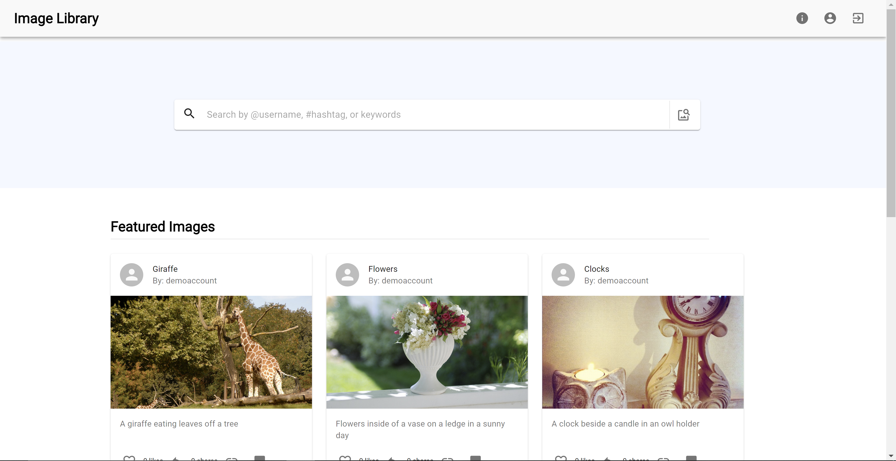
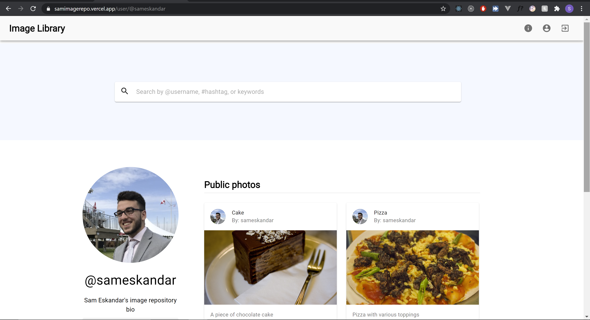
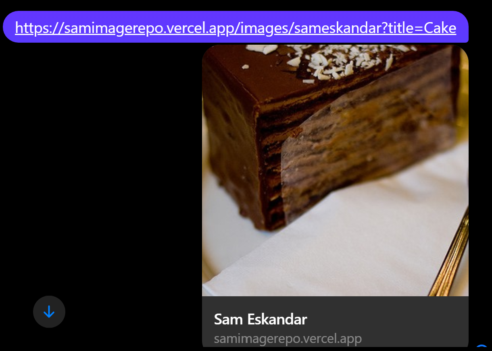

# Shopify Application - Image Repository

### Live site: https://samimagerepo.vercel.app/

This is an image repository built by Sam Eskandar for the Shopify Fall 2021 Developer Challenge

### Tech Stack
- Frontend
  - NextJS
  - React

- Backend
  - Django
  - Tensorflow
  - Flask
  - Docker
  
View images on the featured page, sorted by the amounts of likes and shares each photo has

View user profiles, and all of their public photos

The image repository supports sharing profiles and images via share buttons. NextJS is used for proper SEO when sharing links

